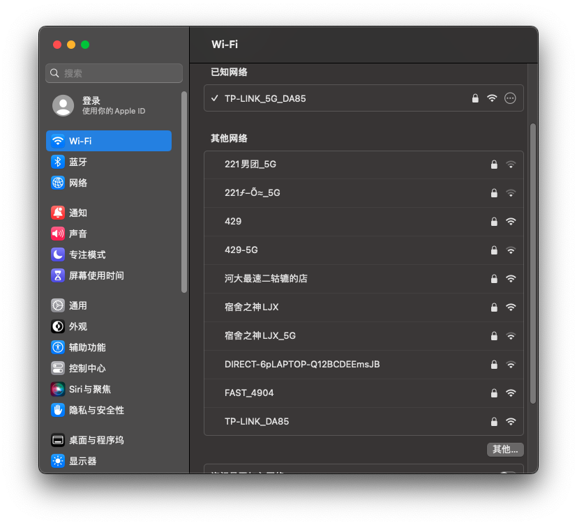
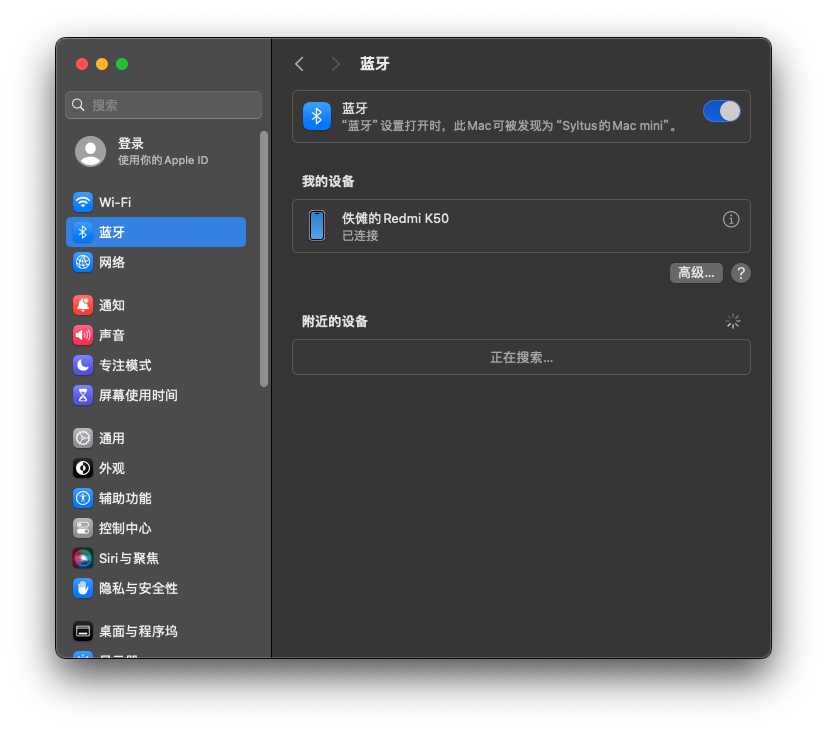

# EFI-Asus-Chromebox-3
OpenCore Hackintosh EFI for Asus Chromebox 3/CN65 (TEEMO).

Based on [sqlsec's EFI](https://github.com/sqlsec/Asus-ChromeBox-i7-8550U/).

**Supported machines:**
- Asus Chromebox 3 (CN65) - Intel Core i7-8550U @1.8Ghz
- Asus Chromebox 3 (CN65) - Intel Core i5-8250U @1.60Ghz


**Differences compare to sqlsec's:**
- Supported macOS 14 (```Sonoma```).
- Added original wireless network adapter (Intel 7265, by ```AirportItlwm.kext``` for macOS 14) and its Bluetooth drivers(```BlueToolFixup.kext``` and ```IntelBluetoothFirmware.kext```).



