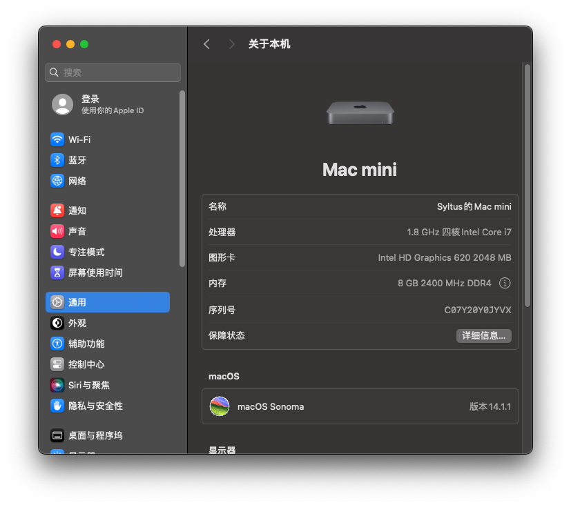

# EFI-Asus-Chromebox-3
OpenCore Hackintosh EFI for Asus Chromebox 3/CN65 (TEEMO).

Based on [sqlsec's EFI](https://github.com/sqlsec/Asus-ChromeBox-i7-8550U/).

**Difference:**
- Compatible with macOS 14 Sonoma.
- Added original wireless network adapter (Intel 7265) and its Bluetooth drivers instead of Broadcom ones.

